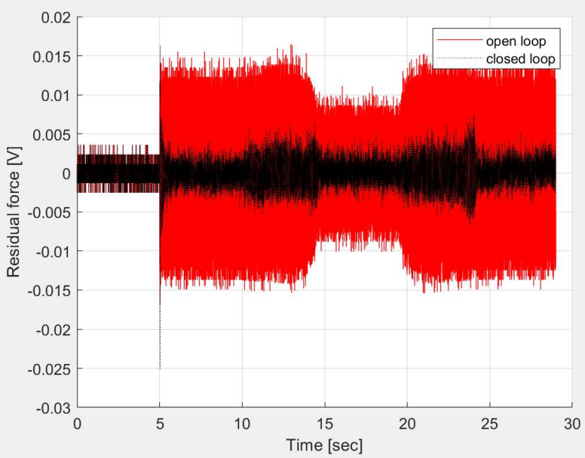

# Ruizhe Zhao Portfolio

## [中文简历PDF](https://github.com/laozhao43/Ruizhe_Zhao_Portfolio/blob/main/Resume_pdfs/%E8%B5%B5%E7%9D%BF%E5%93%B2_%E7%AE%80%E5%8E%86_DJI.pdf) 
# [Project 1: Meltybrain格斗机器人](https://github.com/laozhao43/Meltybrain_Bot_CNMB) 
* 设计并建造 1.36kg 级别格斗机器人，移动方式为旋转平移
* 用 Arduino 编程，读取传感器和接收机信号。算法会根据传感器数据计算出当前转速和当前朝向并控
制机器人在旋转的同时移动。通过蓝牙模块发送实时数据给电脑
* 用 Python 处理回传数据，进行线性回归，并得出一组常数来校准加速计
* 用 SOLIDWORKS 建模，并进行结构设计，受力分析和拓扑优化。机器人在满油门下可以储存 130J
的旋转动能，武器尖端线速度可以达到 100km/h
* Seattle Bot Battles 比赛战绩：3 赢 2 输

# [Project 2: PACCAR 电动卡车里程估计](https://github.com/laozhao43/PACCAR_Capston_Project/blob/main/MD_and_HD_Vehicle_Range_Estimation_Final_Report.pdf) 
* 用 MATLAB 编写一个根据卡车行驶数据预测行驶里程的程序
* 基于卡车的物理模型，使用线性回归预估常数量，并计算出卡车功耗，并与理论值对比
* 同时尝试了其他方法比如梯度提升决策树和 LASSO 回归
* 线性回归的误差最低，计算量较小，在 10 小时的测试数据集中，预估能量消耗误差为 4%

# [Project 3：自适应控制](https://github.com/laozhao43/AdaptiveControl) 
* 基于 Parameter Adaptation Algorithm 和最小二乘的思想达成消噪和抗干扰
* 推导关键公式，在 MATLAB 中复现论文中的功能，其中的系统能抵抗恒定或持续变化频率的震动

